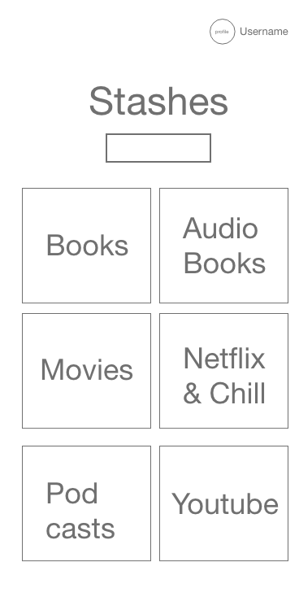

# Unit 4 - Stash'd

## Heroku Link 
https://stashd.herokuapp.com/welcome

## Purpose  
Have you ever had someone recommend an interesting book to read, or a thrilling netflix video you should watch, and when you wanted to actually induldge you couldn't find the link or forgot the name? This is where the Stash'd app comes in to play! 

Stash'd is a web application that serves as a central location to store all of things you'd like to come back to later to enjoy! This could be a list of vegan recipes you found on facebook, or even tips on landing your next job! The possibilities are endless, use Stash'd to organize your future.

## User Stories

- As a user I will upload images/screenshots of media

- As a user I will attach links to my posts

- As a user I will create new categories for my posts

- As a user I will add items to categories

- As a user I will delete items from categories

- As a user I will edit items in my lists

- As a user I will edit items in my lists

- As a user I will be able to create and delete my own profile

## Trello 
https://trello.com/b/cFBa2M5A/unit-4-stashd

## Wireframes

### Adobe XD Link
- https://xd.adobe.com/view/c781f9c9-3b0f-4e76-51af-84656ac7be47-b1b0/?hints=off

## Final Design

## Resources
- Bulma https://bulma.io/
- 3rd party API: https://my.linkpreview.net/

## Tech Used
- Javascript
- Express
- Mongoose
- MongoDB
- NodeJs
- ReactJs

## 2.0 features
- Create a search page for users to view other users' stashes 
- Add user authentication
